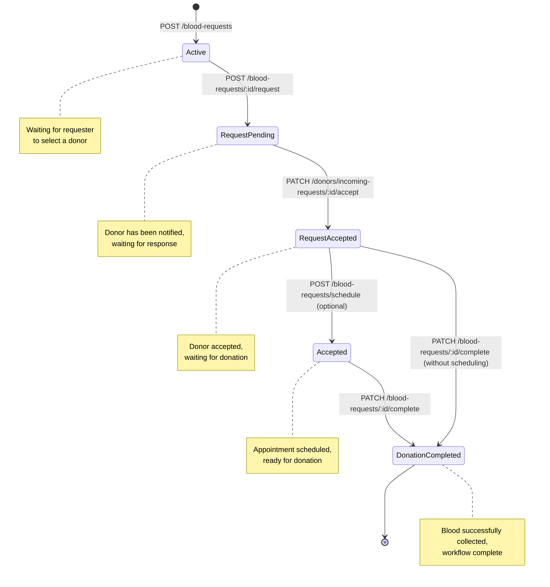
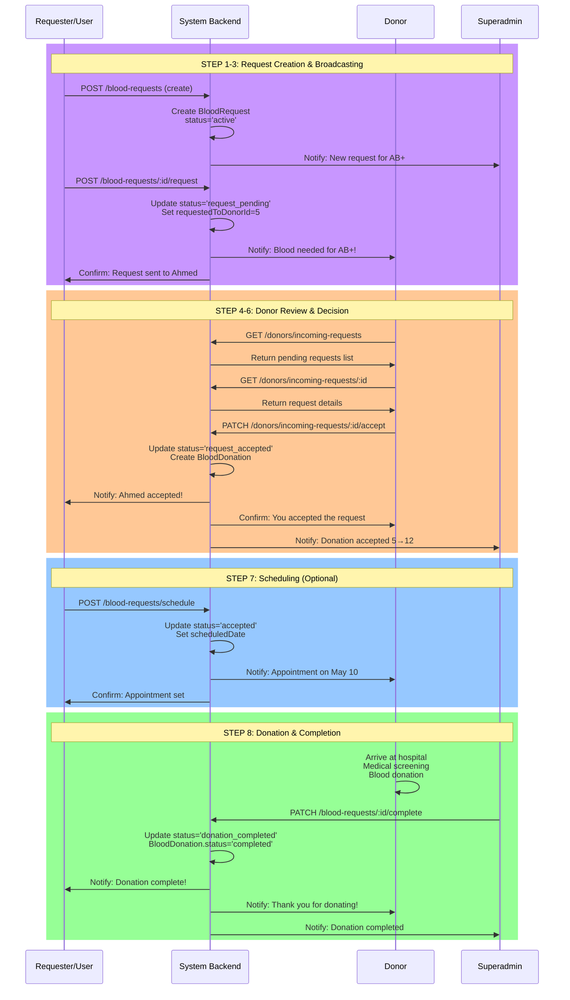
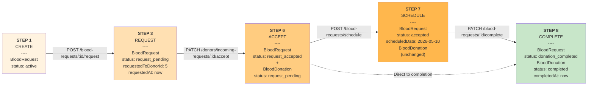
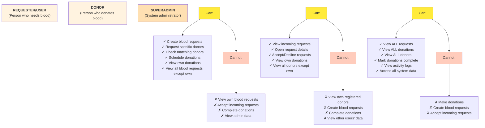
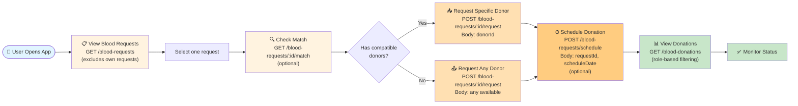

# Complete Blood Donation Workflow Diagram

## Interactive Flowchart

```mermaid
graph TD
    Start([Blood Need Identified]) --> CreateReq["<b>STEP 1: CREATE REQUEST</b><br/>Requester fills form<br/>bloodGroup, units, urgency, location"]
    CreateReq --> ReqActive["✓ BloodRequest created<br/>status: 'active'<br/>Notification → Superadmin"]
    
    ReqActive --> Decision1{Requester checks<br/>own donors first?}
    Decision1 -->|Yes| CheckMatch["<b>STEP 2: CHECK MATCH</b><br/>GET /blood-requests/:id/match<br/>View compatible donors"]
    CheckMatch --> MatchResult["✓ See list of matching donors<br/>OR no matches found<br/>status: 'active' (unchanged)"]
    Decision1 -->|No| SendReq["<b>STEP 3: REQUEST DONOR</b><br/>POST /blood-requests/:id/request<br/>Select specific donor to request"]
    MatchResult --> SendReq
    
    SendReq --> ReqPending["✓ BloodRequest updated<br/>status: 'request_pending'<br/>requestedToDonorId: 5<br/>Notification → Donor Ahmed<br/>Notification → Requester"]
    
    ReqPending --> DonorSees["<b>STEP 4: DONOR SEES REQUEST</b><br/>GET /donors/incoming-requests<br/>Shows pending requests for donor's blood types"]
    DonorSees --> DonorNotif["✓ Donor sees incoming requests list<br/>status: 'request_pending' (unchanged)"]
    
    DonorNotif --> DonorOpen["<b>STEP 5: DONOR OPENS DETAILS</b><br/>GET /donors/incoming-requests/:id<br/>View full request information"]
    DonorOpen --> DonorRead["✓ Donor reads:<br/>• Requester name<br/>• Blood needed<br/>• Hospital location<br/>• Urgency<br/>status: 'request_pending' (unchanged)"]
    
    DonorRead --> Decision2{Donor decision}
    Decision2 -->|Decline| Declined["Request stays 'request_pending'<br/>Donor dismisses notification"]
    Decision2 -->|Accept| DonorAccept["<b>STEP 6: DONOR ACCEPTS</b><br/>PATCH /donors/incoming-requests/:id/accept<br/>Donor commits to donate"]
    Declined --> End1([Request Expires])
    
    DonorAccept --> Accepted["✓ BloodRequest updated<br/>status: 'request_accepted'<br/><br/>✓ BloodDonation CREATED<br/>status: 'request_pending'<br/>donorId: 5<br/>requestId: 12<br/><br/>Notification → Requester<br/>Notification → Donor"]
    
    Accepted --> Decision3{Schedule<br/>appointment?}
    Decision3 -->|No| PendingWait["Request ready for donation<br/>status: 'request_accepted'<br/>Donation status: 'request_pending'"]
    Decision3 -->|Yes| Schedule["<b>STEP 7: SCHEDULE DONATION</b><br/>POST /blood-requests/schedule<br/>Set date & time"]
    
    Schedule --> Scheduled["✓ BloodRequest updated<br/>status: 'accepted'<br/>scheduledDate: 2026-05-10T14:00Z<br/><br/>Notification → Both parties"]
    PendingWait --> DonationDay
    Scheduled --> DonationDay["<b>STEP 8: DONATION DAY</b><br/>Donor arrives at hospital<br/>Medical screening<br/>Blood collection (15-20 min)<br/>Recovery & discharge"]
    
    DonationDay --> Complete["<b>MARK COMPLETE</b><br/>PATCH /blood-requests/:id/complete<br/>Hospital staff marks in system"]
    
    Complete --> Completed["✓ BloodRequest updated<br/>status: 'donation_completed'<br/><br/>✓ BloodDonation updated<br/>status: 'completed'<br/>completedAt: timestamp<br/><br/>Notification → Both parties<br/>Notification → Hospital<br/>Notification → Superadmin"]
    
    Completed --> End2(["✅ Workflow Complete<br/>Blood successfully donated"])
    
    style Start fill:#e1f5ff
    style CreateReq fill:#fff3e0
    style ReqActive fill:#f3e5f5
    style CheckMatch fill:#fff3e0
    style SendReq fill:#fff3e0
    style ReqPending fill:#f3e5f5
    style DonorSees fill:#fff3e0
    style DonorOpen fill:#fff3e0
    style DonorAccept fill:#fff3e0
    style Accepted fill:#f3e5f5
    style Schedule fill:#fff3e0
    style Scheduled fill:#f3e5f5
    style DonationDay fill:#fff3e0
    style Complete fill:#fff3e0
    style Completed fill:#c8e6c9
    style End2 fill:#c8e6c9
    style End1 fill:#ffccbc
```

---

## State Transition Diagram

---

## Parallel Actor Timeline

---

## Data State Changes at Each Step

---

## Role-Based Access Matrix

---

## Notification Flow

```mermaid
graph TD
    Step1["STEP 1: Request Created"] -->|Notify| SA1["Superadmin:<br/>New blood request<br/>Blood Group: AB+<br/>Units: 2"]
    
    Step3["STEP 3: Request Sent to Donor"] -->|Notify| Don1["Donor Ahmed:<br/>Blood needed for AB+<br/>Urgent case<br/>Location: Hospital X"]
    Step3 -->|Notify| Req1["Requester Rania:<br/>Request sent to Ahmed<br/>Awaiting response"]
    
    Step6["STEP 6: Donor Accepts"] -->|Notify| Req2["Requester Rania:<br/>Ahmed accepted!<br/>Donation pending"]
    Step6 -->|Notify| Don2["Donor Ahmed:<br/>You accepted<br/>Donation pending"]
    Step6 -->|Notify| SA2["Superadmin:<br/>Donation accepted<br/>Donor 5 → Request 12"]
    
    Step7["STEP 7: Scheduled"] -->|Notify| Don3["Donor Ahmed:<br/>Appointment set<br/>Date: May 10, 2pm"]
    Step7 -->|Notify| Req3["Requester Rania:<br/>Appointment confirmed<br/>Date: May 10, 2pm"]
    
    Step8["STEP 8: Completed"] -->|Notify| Req4["Requester Rania:<br/>Donation complete!<br/>Blood ready"]
    Step8 -->|Notify| Don4["Donor Ahmed:<br/>Thank you for donating!<br/>Next donation: 8 weeks"]
    Step8 -->|Notify| Hosp["Hospital:<br/>Blood available<br/>For transfusion"]
    Step8 -->|Notify| SA3["Superadmin:<br/>Donation completed<br/>Request 12 fulfilled"]
    
    style Step1 fill:#fff3e0
    style Step3 fill:#ffe0b2
    style Step6 fill:#ffcc80
    style Step7 fill:#ffb74d
    style Step8 fill:#c8e6c9
```

---

## API Call Sequence Diagram for Frontend Developer

---

## Summary Table

| Phase | Step | Actor | Endpoint | Method | Status Before | Status After |
|-------|------|-------|----------|--------|---|---|
| 1 | Create Request | Requester | `/blood-requests` | POST | - | `active` |
| 2 | Check Match | Requester | `/blood-requests/:id/match` | GET | `active` | `active` |
| 3 | Request Donor | Requester | `/blood-requests/:id/request` | POST | `active` | `request_pending` |
| 4 | View Incoming | Donor | `/donors/incoming-requests` | GET | `request_pending` | `request_pending` |
| 5 | Open Request | Donor | `/donors/incoming-requests/:id` | GET | `request_pending` | `request_pending` |
| 6 | Accept Request | Donor | `/donors/incoming-requests/:id/accept` | PATCH | `request_pending` | `request_accepted` |
| 7 | Schedule Date | Requester | `/blood-requests/schedule` | POST | `request_accepted` | `accepted` |
| 8 | Complete | Admin | `/blood-requests/:id/complete` | PATCH | `accepted` | `donation_completed` |
