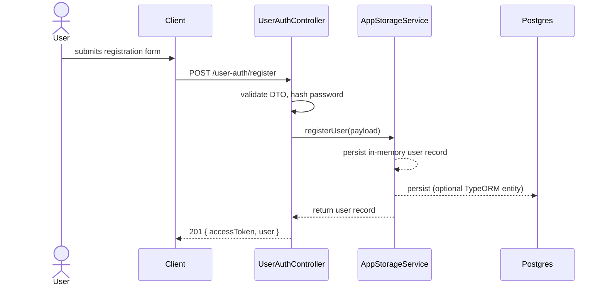
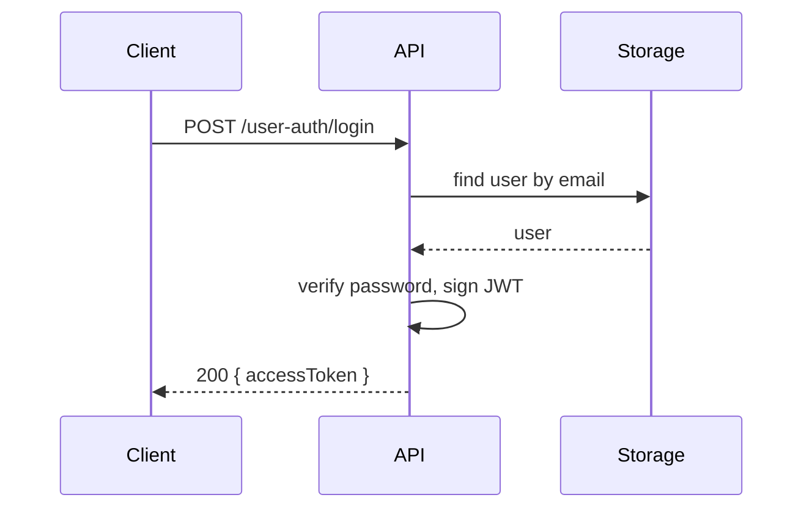
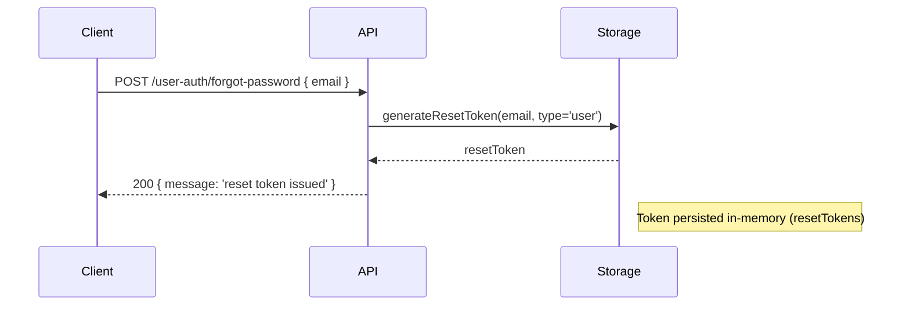
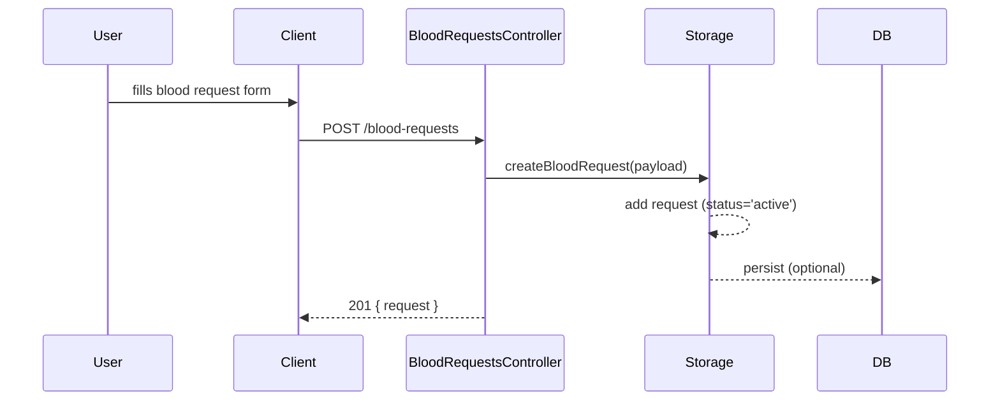
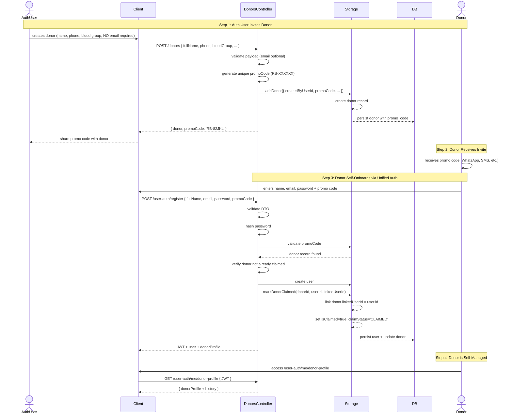
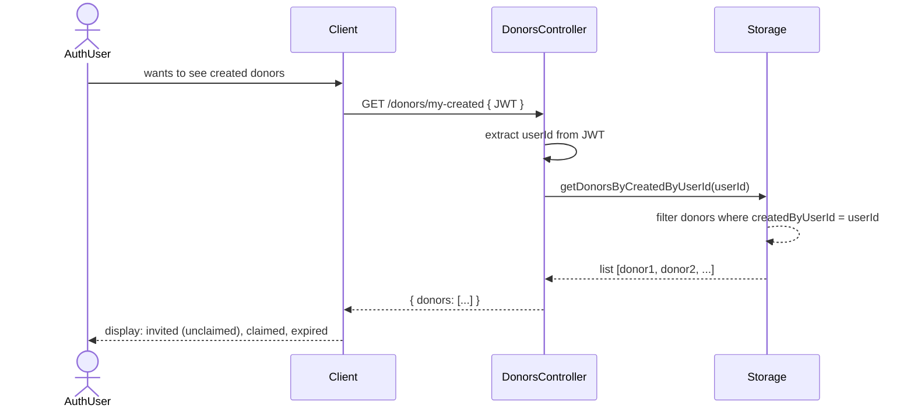
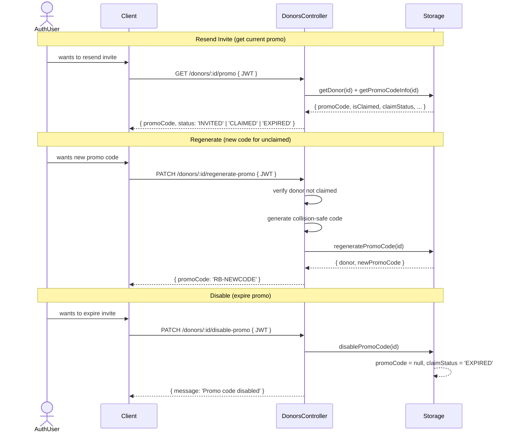

# Backend Data Flow Diagrams (DFD)

Last updated: 2026-05-01

This document contains logical and physical Data Flow Diagrams (DFD) for the Rehma Blood backend API, plus sequence diagrams for major flows.

## Legend
- External actor: person or external system (User, Donor, SuperAdmin, Hospital)
- Process: server-side module or controller (e.g., `UserAuthController`, `BloodRequestsService`)
- Data store: persistent stores (Postgres via TypeORM) or in-memory store (`AppStorageService`)
- Infrastructure: Docker services (app, db, redis, pgAdmin)

---

## 1) Logical DFD (Level 1)

```mermaid
flowchart TB
  subgraph Actors
    U[User]
    D[Donor]
    SA[SuperAdmin]
    H[Hospital]
  end

  subgraph API[NestJS Backend (Processes)]
    UA[UserAuthController]
    BA[BloodRequestsController]
    DA[DonorsController]
    AD[DashboardController]
    MAP[MapService]
  end

  subgraph Storage[Storage]
    APP[AppStorageService (in-memory)]
    DB[(Postgres via TypeORM)]
    REDIS[(Redis cache)]
  end

  U -->|POST /user-auth/register| UA
  U -->|POST /user-auth/login| UA
  U -->|POST /user-auth/forgot-password| UA
  UA -->|validate, hash password| APP
  UA -->|return JWT| UA
  UA -->|user data| DB

  U -->|POST /blood-requests| BA
  BA -->|store request| APP
  BA -->|optionally persist| DB

  D -->|GET /blood-requests/active| BA
  D -->|PATCH /blood-requests/:id/status| BA
  BA -->|update status and acceptedBy| APP
  BA -->|on donation_completed create donation record| APP
  APP -->|synchronize| DB

  SA -->|manage donors/requests| AD
  MAP -->|geolocation lookup| BA

  APP -.->|cache / ephemeral| REDIS
  DB -.->|long-term storage| REDIS

  classDef external fill:#f9f,stroke:#333;
  class U,D,SA,H external;
  class APP,DB,REDIS fill:#efe,stroke:#333
  class API fill:#eef,stroke:#333

```

### Notes (Logical)
- Primary processes are Nest controllers + services.
- `AppStorageService` is the in-memory domain store used by many controllers for Users, Donors, BloodRequests, BloodDonations, and ResetTokens.
- TypeORM entities exist for Donor, BloodRequest, BloodDonation, SuperAdmin; `DatabaseModule` is configured with synchronize: true, so DB schema can reflect entity changes.
- Redis is present (for caching or pub/sub) but currently used lightly (map/cache hints).

---

## 2) Physical DFD (Deployment)

```mermaid
flowchart LR
  subgraph Host[Developer / Production Host]
    AppContainer[app (NestJS)\nDocker container]
    DBContainer[db (Postgres 15)\nDocker container]
    RedisContainer[redis (7-alpine)\nDocker container]
    PgAdmin[pgAdmin]\n  end

  UserBrowser[User / Donor / Admin Browser]

  UserBrowser -->|HTTP 7676| AppContainer
  AppContainer -->|TCP 5432 (mapped: 5435 on host)| DBContainer
  AppContainer -->|TCP 6379 (mapped 6380)| RedisContainer
  Admin -->|pgAdmin UI 5052| PgAdmin

  note right of AppContainer
    - Runs NestJS application
    - Handles controllers, services
    - Exposes Swagger at /docs
  end

  note right of DBContainer
    - Stores persistent entities
    - TypeORM synchronize may alter schema
  end

  style AppContainer fill:#eef,stroke:#333
  style DBContainer fill:#efe,stroke:#333
  style RedisContainer fill:#ffd,stroke:#333

```

### Deployment notes
- Use `docker compose up --build` in project root; compose defines services: `app`, `db`, `redis`, `pgadmin`.
- App listens on host port `7676` (maps to container `3000`).
- Postgres default is mapped to `5435` on host (compose config), redis mapped to `6380`, pgAdmin to `5052`.

---

## 3) Key API Sequence Diagrams

### 3.1 User Registration



### 3.2 Login



### 3.3 Forgot Password (User)



### 3.4 Create Blood Request



### 3.5 Unified Donor Onboarding: Create → Invite → Claim



### 3.6 Creator Tracks Invited Donors



### 3.7 Promo Code Lifecycle



---

## 4) Data Stores and Entities (updated)

- AppStorageService (in-memory):
  - users: { id, fullName, email, passwordHash, mobileNumber, dateOfBirth, weight, bloodGroup, lastBloodDonation, createdAt }
  - donors: { id, fullName, email?, phone?, bloodGroup?, isActive, isAvailable, passwordHash?, latitude?, longitude?, **promoCode?**, **isClaimed**, **claimedAt?**, **createdByUserId?**, **claimedByUserId?**, **linkedUserId?**, **claimStatus?**, createdAt, updatedAt }
  - bloodRequests, bloodDonations, resetTokens

- Postgres (TypeORM entities):
  - **Donor** (updated with promo fields)
    - promoCode: string (unique, nullable) — invite code for onboarding
    - isClaimed: boolean (default=false) — whether donor registered
    - claimedAt: timestamp (nullable) — when donor claimed the invite
    - createdByUserId: int (nullable) — who invited this donor
    - claimedByUserId: int (nullable) — which user claimed it
    - linkedUserId: int (nullable) — user account ID if claimed
    - promoCodeExpiresAt: timestamp (nullable) — optional expiration
    - claimStatus: ENUM('INVITED', 'CLAIMED', 'EXPIRED')
  - BloodRequest (status, acceptedByDonorId, acceptedByDonorName, acceptedAt, completedAt)
  - BloodDonation (donorId, status)
  - SuperAdmin

### Donor Ownership Model

```
AuthUser (creator)
   └──→ [created] Donor #1
        ├── promoCode: 'RB-82JKL'
        ├── createdByUserId: 1 (AuthUser.id)
        ├── isClaimed: false
        └── linkedUserId: null

        [Later, Donor registers with promo code]
        ├── isClaimed: true
        ├── linkedUserId: 5 (new User.id)
        ├── claimedByUserId: 5
        ├── claimedAt: 2026-05-02T10:00:00Z
        └── claimStatus: 'CLAIMED'

AuthUser (creator) can query:
   GET /donors/my-created → [Donor #1, Donor #2, ...] (all created, both claimed & unclaimed)

Donor (now self-managed):
   GET /user-auth/me/donor-profile → Donor #1 (linked via linkedUserId)
```

Notes:
- The current codebase uses `AppStorageService` as the operational store for many flows while TypeORM entities exist for persistence. For production, migrate operational flows to TypeORM repositories and transactions.
- Promo code ownership is tracked via `createdByUserId` on Donor entity — the creator can manage/revoke invites.
- After claim, `linkedUserId` and `claimedByUserId` allow tracking both the creator and the claimer.
- `claimStatus` enum provides clear state: INVITED (unclaimed), CLAIMED (registered), EXPIRED (revoked).
- Consider adding cascade soft-delete and audit logs (who created, who claimed, when) for enterprise-ready tracking.

---

## 5) API Endpoints (updated)

### Auth / User (unified)
  - `POST /user-auth/register` — register user (with optional `promoCode` to claim donor)
  - `POST /user-auth/login` — login
  - `GET /user-auth/me` — get profile (requires Bearer `jwt`)
  - `GET /user-auth/me/donor-profile` — **NEW** get linked donor profile (if user claimed a donor)
  - `POST /user-auth/forgot-password` — issue reset token
  - `POST /user-auth/reset-password` — reset with token

### Donor Invitation & Onboarding (NEW)
  - `POST /donors` — **NEW** auth-user creates donor (no email required), gets promo code
  - `GET /donors/my-created` — **NEW** list all donors created by authenticated user (with claim status)
  - `GET /donors/:id/promo` — **NEW** get promo code and claim status for a donor
  - `PATCH /donors/:id/regenerate-promo` — **NEW** generate new promo code (unclaimed only)
  - `PATCH /donors/:id/disable-promo` — **NEW** expire/disable a promo code

### Blood Requests (unchanged)
  - `POST /blood-requests` — create request (user)
  - `GET /blood-requests` — list
  - `GET /blood-requests/active` — donors view
  - `PATCH /blood-requests/:id/status` — update status (accepted, on_the_way, arrived_at_hospital, donation_completed)

### Donors / Donations (existing + new)
  - `POST /donors` — create donor with promo code
  - `GET /donors` — list all donors
  - `GET /donors/:id` — get donor by ID
  - `GET /donors/my-created` — list created by authenticated user
  - `GET /donors/:id/promo` — get promo info
  - `PATCH /donors/:id` — update donor profile
  - `PATCH /donors/:id/disable-promo` — disable promo
  - `PATCH /donors/:id/regenerate-promo` — regenerate promo
  - `DELETE /donors/:id` — delete donor
  - `GET /blood-donations` — list donations

---

## 6) Production-Ready Donor Referral Flow (Implemented)

### Architecture Goals
✅ **Unified Authentication** — Donors use `/user-auth/register` with optional `promoCode`  
✅ **Self-Managed Onboarding** — No separate `/donor-auth/register` endpoint  
✅ **Creator Ownership Tracking** — Inviter can query created donors via `/donors/my-created`  
✅ **Donor Autonomy** — After signup, donor manages own profile and history  
✅ **Promo Lifecycle** — Create, regenerate, disable, expire promo codes  
✅ **Clear Relationships** — `createdByUserId` (creator), `linkedUserId` (self-managed), `claimedByUserId` (claimer)  

### Current Implementation Status
- ✅ Donor entity extended with promo/claim fields
- ✅ Promo code generation (collision-safe, unique, indexed)
- ✅ Creator creates donor (no email required) → auto-generates promo
- ✅ Donor claims via unified `/user-auth/register + promoCode`
- ✅ Transactional claim (mark claimed, link user, set role=donor)
- ✅ Creator queries `/donors/my-created` to track invites
- ✅ Donor retrieves own profile via `/user-auth/me/donor-profile`
- ✅ Promo management endpoints (regenerate, disable, info)

### Next Steps (Post-MVP)

1. **Database Transactions** — Migrate registration to TypeORM repository with transactional guarantee.
2. **Audit Logging** — Track: who created, who claimed, when, from where.
3. **Promo Expiry** — Implement time-based expiration (e.g., 30 days).
4. **Rate Limiting** — Prevent brute-force promo guessing.
5. **Email/SMS Integration** — Send promo codes via Twilio, SendGrid.
6. **Analytics Dashboard** — Creator sees: invited count, claimed count, conversion rate, donation history.
7. **Soft Deletes** — Preserve audit trail if invite is cancelled.
8. **Bulk Invite API** — Allow batch creation of donor invites.
9. **Notification System** — Event-driven (donor.claimed, donation.completed) → Firebase/BullMQ.
10. **Enterprise Features** — Role-based access (org admin, team lead), team donor pools, delegation.
